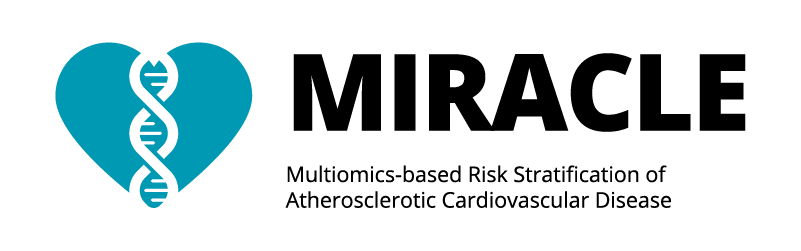
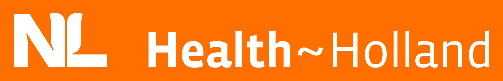
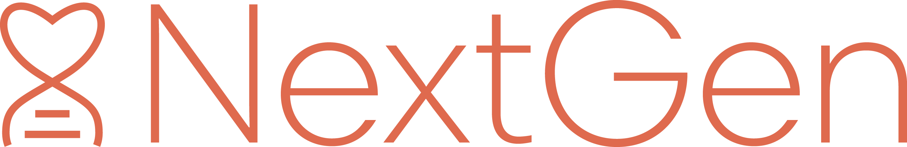

<!--  ## AE_TEMPLATE -->
<!--   -->
<!--  This is a "Lookup request" template.  -->
<!--  The naming of the repository should follow the convention we use in > Trello, _etc._, _e.g._  "AE_20190910_008_JHILLEBRANDS_SDEJAGER_TEMS_TIE2". -->
<!--   -->
<!--  This template includes some (standard) codes/scripts for: -->
<!--   -->
<!--  - baseline tables, sample selections -->
<!--  - SNP lookups, GWAS, or gene-based lookups -->
<!--  - bulk RNAseq analyses -->
<!--  - scRNAseq projections and lookups -->

<!--  Provide a title.         -->
[RePlaq](https://github.com/CirculatoryHealth/RePlaq)
============

<!--  Provide details on the people involved in the project.         -->
*RePlaq Team*

Sander W. van der Laan, 
Jessica van Setten, 
Michal Mokry, 
Gerard Pasterkamp.

<!--  Provide the project ID.         -->
**Project ID** [`RePlaq`]

# Background
<!--  Provide some background, study design, results, etc.         -->
**RePlaq**: "**Re**plicating the expression quantitative trait loci of carotid **Plaq**ues in the Athero-Express Biobank Study" aims to replicate the findings of [Folkersen _et al._ 2010](https://doi.org/10.1161/CIRCGENETICS.110.948935). 

## Study design

We will replicate Folkersen _et al._ by associating 168 known cardiovascular genetic loci to carotid plaque gene expression. 

### Athero-Express Biobank Study

We have bulk RNAseq (n ± 1,193 samples) and overlapping genetic data for 1,989 individuals with extensive clinical data. 

### Genetic analyses

For the eQTL analyses we will use TensorQTL using age, sex (where applicable), genetic principal components, and PEER-factors to account for confounding. 

We will perform regression analyses adjusted for age, sex (where applicable) and principal components. 

- model 1: `phenotype ~ age + sex + PCs + PEER-factors`

## Aims

Aim 1: Replicate the findings of Folkersen _et al._ 2010 in the Athero-Express Biobank Study.

Aim 2a: Execute _cis_- and _trans_-eQTL analyses using all data to expand the number of eQTLs identified in carotid plaques.

Aim 2b: Execute these eQTL analyses stratified by sex and perform interaction analyses to enrich the interpretability of the eQTLs.

Aim 3: Perform a meta-analysis of the eQTL results with the publically available Folkersen _et al._ 2010 results.

# Where do I start?

You can load this project in RStudio by opening the file called 'RePlaq.Rproj'.

## Project structure

<!--  You can add rows to this table, using "|" to separate columns.         -->
File                                    | Description                          | Usage         
--------------------------------------- | ------------------------------------ | --------------
README.md                               | Description of project               | Human editable
RePlaq.Rproj                       | Project file                         | Loads project
LICENSE                                 | User permissions                     | Read only
.worcs                                  | WORCS metadata YAML                  | Read only
renv.lock                               | Reproducible R environment           | Read only
images                                  | image directory for project          | Human editable
BASELINE                                | Baseline characteristics directory   | Human editable
OUTPUT                                  | Output directory                     | Human editable
PLOTS                                   | Some results                         | Human editable
scripts                                 | Scripts directory                    | Human editable
packages.bib                            | BibTex references for packages used  | Human editable
references.bib                          | BibTex references                    | Human editable
1_AEDB.CEA.baseline.Rmd                | Preparing data, baseline table       | Human editable

<!--  You can consider adding the following to this file:                    -->
<!--  * A citation reference for your project                                -->
<!--  * Contact information for questions/comments                           -->
<!--  * How people can offer to contribute to the project                    -->
<!--  * A contributor code of conduct, https://www.contributor-covenant.org/ -->

### 1. AEDB.CEA.baseline.Rmd

This notebook is used to create a `RDS`-formatted datasets with the selection of samples.

### manuscript & preregistration

In the spirit of Open Science we will preregister this work upon funding through [OSF](https://osf.io). However, in the spirit of transparency this GitHub is already available for the reviewer. 

# Reproducibility

This project uses the Workflow for Open Reproducible Code in Science (WORCS) to ensure transparency and reproducibility according to the principles of [FAIR](https://www.go-fair.org/fair-principles/). The workflow is designed to meet the principles of Open Science throughout a research project. 

To learn how WORCS helps researchers meet the TOP-guidelines and FAIR principles, read the preprint at https://osf.io/zcvbs/.

This repository works with `renv`. This is a package that creates a reproducible environment for your project. It is a good practice to use `renv` to ensure that your project is reproducible. However, it is not mandatory and it is up to the user to decide whether to use it or not.

## WORCS: Advice for authors

* To get started with `worcs`, see the [setup vignette](https://cjvanlissa.github.io/worcs/articles/setup.html)
* For detailed information about the steps of the WORCS workflow, see the [workflow vignette](https://cjvanlissa.github.io/worcs/articles/workflow.html)

## WORCS: Advice for readers

Please refer to the vignette on [reproducing a WORCS project]() for step by step advice.
<!-- If your project deviates from the steps outlined in the vignette on     -->
<!-- reproducing a WORCS project, please provide your own advice for         -->
<!-- readers here.                                                           -->

# Acknowledgements
Dr. Sander W. van der Laan is funded through EU H2020 TO_AITION (grant number: 848146), EU HORIZON NextGen (grant number: 101136962), EU HORIZON MIRACLE (grant number: 101115381), and Health~Holland PPP Allowance ‘Getting the Perfect Image’.

We are thankful for the support of the Leducq Fondation ‘PlaqOmics’ and ‘AtheroGen’, and the Chan Zuckerberg Initiative ‘MetaPlaq’. The research for this contribution was made possible by the AI for Health working group of the [EWUU alliance](https://aiforhealth.ewuu.nl/). The collaborative project ‘Getting the Perfect Image’ was co-financed through use of PPP Allowance awarded by Health~Holland, Top Sector Life Sciences & Health, to stimulate public-private partnerships.

Plaque samples are derived from endarterectomies as part of the [Athero-Express Biobank Study](https://doi.org/10.1007/s10564-004-2304-6) which is an ongoing study in the UMC Utrecht. We would like to thank all the (former) employees involved in the Athero-Express Biobank Study of the Departments of Surgery of the St. Antonius Hospital Nieuwegein and University Medical Center Utrecht for their continuing work. Lastly, we would like to thank all participants of the Athero-Express Biobank Study; without you these kinds of studies would not be possible.

The framework was based on the [`WORCS` package](https://osf.io/zcvbs/).

## Disclosures
Dr. Sander W. van der Laan has received Roche funding for unrelated work.

        

#### Changes log
    
    _Version:_      v1.0.0 
    _Last update:_  2025-03-05 
    _Written by:_   Sander W. van der Laan (s.w.vanderlaan [at] gmail [dot] com).
    
    **MoSCoW To-Do List**
    The things we Must, Should, Could, and Would have given the time we have.
    _M_
    
    _S_
    
    _C_

    _W_

    **Changes log**
    * v1.0.0 Initial version. Based on AE_TEMPLATE (v1.4.6).

--------------

#### Creative Commons BY-NC-ND 4.0
##### Copyright (c) 1979-2025 Sander W. van der Laan | s.w.vanderlaan [at] gmail [dot] com.
